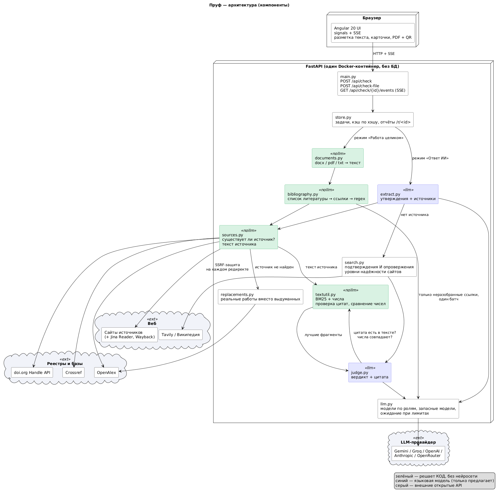

# Trustable? — можно ли верить ответу ИИ

> **Trustable?** — «заслуживает ли доверия?». Этот вопрос мы задаём каждому утверждению в ответе нейросети. Ответ — не «оценка доверия» от другой нейросети, а **дословная цитата из реального источника**, которую проверил код. Или честное объяснение, почему верить нельзя.

**Демо:** https://pruf-35gj.onrender.com  ·  **Кейс:** WIT Teens Challenge 2026, «AI Trust: можно ли доверять ответу ИИ?»



---

## Что умеет

**1. Текст.** Вставьте ответ ChatGPT, Gemini, Claude или любой другой нейросети (подойдёт и статья, новость, реферат). Каждое утверждение подсвечивается вердиктом, у каждого вердикта — объяснение, цитата и ссылка. За один текст проверяется до 12 утверждений.

**2. Документ.** Загрузите курсовую, диплом, статью или отчёт (.docx / .pdf / .txt / .md, до 10 МБ).
- Есть список литературы («Список литературы», «References», «Пайдаланылған әдебиеттер»…) — проверим **каждый** источник из него, до 15 утверждений со ссылками на них ([1], [2, с. 15], (Иванов, 2020)) и до 6 фактов без ссылок (их — по интернету). Если источник закрыт или не открылся, утверждение проверяется по интернету с пометкой. Итог — «Достоверность источников: N из M», таблица ссылок и **PDF-отчёт с QR-кодом**.
- Списка нет — выберем из всего документа самые проверяемые утверждения о фактах и числах (до 12). Титульный лист, оглавление, личные данные, даты практики и обязанности не проверяем: их нельзя сверить с открытыми источниками.

**3. Языки и тема.** Интерфейс, сообщения и объяснения нейросети — на русском, английском и казахском; светлая и тёмная тема.

**Выдуманная ссылка?** Trustable? не просто скажет «фейк», а предложит реальные работы по той же теме (OpenAlex) с кнопкой «скопировать ссылку по ГОСТ / APA».

### Вердикты

| Вердикт | Что это значит | Кто решает |
|---|---|---|
| **Источник не существует** | DOI не зарегистрирован, работы нет ни в Crossref, ни в OpenAlex, домена нет, страница 404 | реестры и код, **без нейросети** |
| **Источник говорит другое** | другое число, перепутаны объекты, более узкий вывод | нейросеть предлагает, код сверяет цитату и **числа** |
| **В источнике этого нет** | источник прочитан, утверждения там нет | нейросеть по фрагментам источника |
| **Не удалось проверить** | пейвол, защита от ботов, только аннотация, база не ответила | честный отказ вместо догадки |
| **Подтверждено цитатой** | нашли место, где сказано то же самое | цитата сверена с текстом источника кодом |

Над вердиктами — матрица **«уверенно ≠ доказано»**: сколько утверждений звучат категорично, но не подтверждены. Это главная опасность: люди верят тону.

---

## Проблема

| Факт | Источник |
|---|---|
| ChatGPT-3.5 выдумал **55%** библиографических ссылок, GPT-4 — **18%** | Walters & Wilder, *Scientific Reports* 13, 14045 (2023), doi:10.1038/s41598-023-41032-5 |
| ИИ-поисковики дали неверную информацию об источнике **более чем в 60%** из 1600 запросов; Grok-3 — в 94% | Tow Center for Digital Journalism (Columbia), 2025, по материалу Nieman Lab |
| В 300 статьях на рецензии ICLR 2026 у 50 нашлись выдуманные ссылки — **3–5 рецензентов их пропустили** | [GPTZero, 2026](https://gptzero.me/news/iclr-2026/) |
| 100 выдуманных ссылок в 51 **принятой** статье NeurIPS 2025 | [GPTZero](https://gptzero.me/news/neurips/), [arXiv:2602.05930](https://arxiv.org/abs/2602.05930) |

### Наш опрос: 56 студентов, сентябрь 2026

| | |
|---|---|
| Используют ИИ для учёбы хотя бы раз в неделю | **53 из 56** (28 — каждый день) |
| Просили у ИИ источники или статистику | **49 из 56** |
| **Всегда** проверяют, что источник существует | **10 из 56** (36 — «иногда», 10 — «никогда») |
| Находили выдуманную ссылку или цифру | **21 из 56**; ещё **29 ни разу не проверяли** |
| Знают случаи наказания за выдуманные источники | **51 из 56** (30 — лично или среди знакомых) |
| Воспользовались бы сервисом проверки | **54 из 56** |
| Пользуются ChatGPT / Claude / Gemini | 47 / 40 / 31 |

**Ручной замер команды:** 5 ответов Gemini и GPT с источниками проверили вручную за **42 минуты** (~8 минут на ссылку: найти работу, открыть, найти место, сверить число). Trustable? — **~3 секунды на ссылку**.

**Для кого:** студенты и школьники (курсовые, рефераты, эссе), преподаватели и научные руководители, все, кто ищет информацию через ИИ. Фокус — Казахстан и СНГ: интерфейс на русском, казахском и английском, ГОСТ-ссылки, казахстанские заголовки списков литературы.

---

## Почему нам можно доверять: ИИ не судит ИИ в одиночку

Путь одного утверждения (на сайте — «лестница»):

| # | Шаг | Кто | Что происходит |
|---|---|---|---|
| 1 | Разбор | нейросеть | делит текст на утверждения и находит ссылки; URL, DOI и маркеры [n] код дополнительно находит сам |
| 2 | Существует ли источник | **реестры** | doi.org → Crossref → OpenAlex; веб-ссылки открываются напрямую. Нейросеть не участвует |
| 3 | Чтение источника | **код** | страница, открытый PDF или аннотация; сайт закрыт от ботов → копия через Jina Reader или веб-архив; пейвол → «нет доступа» |
| 4 | Вердикт с цитатой | нейросеть | читает лучшие фрагменты и **предлагает** вердикт — обязательно с дословной цитатой |
| 5 | Право вето | **код** | цитаты нет в источнике дословно → вердикт выброшен; числа не сходятся → «говорит другое», даже если модель сказала «подтверждено» |
| 6 | Нет источника | веб-поиск + нейросеть | ищем и подтверждения, и **опровержения**; «подтверждено» — только по официальному / научному / справочному сайту или двум независимым |
| 7 | Решение за вами | вы | вердикт, объяснение, цитата и ссылка на экране |

Честно о границе: смысловую оценку «подтверждает ли эта цитата утверждение» делает нейросеть. Код не может её заменить — но может **запретить** вердикт без доказательства и поймать подмену чисел. Поэтому цитата всегда показывается пользователю.

Каждый предохранитель закрыт автотестом — **63 теста**, сеть не нужна (`test_fabricated_quote_from_judge_is_dropped`, `test_supports_but_numbers_differ_becomes_contradicted`, `test_same_quantity_other_number_is_contradicted`, `test_attack_single_weak_site_is_not_enough`, `test_reordered_sentences_count_only_if_each_is_verbatim`…).

---

## Точность (измерено, воспроизводимо)

`cd backend && python -m app.eval --only refs` — 72 ссылки, размеченные командой (34 настоящих, 23 выдуманных, 15 искажённых), включая ссылки, реально сгенерированные Gemini. Ссылки проверяются regex-разбором и реестрами — почти без трат токенов.

| Размечено как | Верно | Не удалось проверить | Ошибка |
|---|---|---|---|
| Настоящие (34) | 31 | 1 | 2 (названы «искажёнными») |
| Выдуманные (23) | 17 | 6 | 0 |
| Искажённые (15) | 15 | 0 | 0 |

- **Ложные обвинения** (настоящий источник назван выдуманным): **0 из 34**.
- Искажённые ссылки (чужой DOI, не те авторы/год) пойманы: **15 из 15**.
- Точность там, где вынесен вердикт: **63 из 65 (97%)**. Среднее время: **3,2 с** на ссылку.
- 6 «не удалось проверить» среди выдуманных — не ошибка: в день замера OpenAlex приостановил анонимный поиск, а без второй базы мы **намеренно** не называем работу выдуманной. Бесплатный `OPENALEX_API_KEY` это закрывает.

**Почему главная метрика — ложные обвинения.** Сказать студенту «твой источник выдуман», когда он настоящий, хуже, чем пропустить фейк: это подрывает доверие к самому инструменту.

**Демо-примеры (живые прогоны, сохранены в `backend/seed_cache/`):**
- «Чистая правда» — подтверждено 3 из 3 цитатами.
- «Полуправда» — 3 верных подтверждены; «37% у ChatGPT Search» опровергнуто (в источнике это Perplexity), «население больше 25 млн» опровергнуто.
- «Ложь с красивым списком литературы» — 2 из 4 источников не существуют; «40% ошибок» опровергнуто цитатой «more than 60% of the time»; перепутанные GPT-4 и GPT-3.5 пойманы.
- «Казахстан без источников» — «Байконур в Карагандинской области» и «население больше 25 млн» опровергнуты.

Набор для утверждений подготовлен — `benchmark/claims.csv` (100: даты, числа, сущности, перестановки) и `claims_hard.csv` (60: перефразы, «почти то же число», выдуманная статистика); прогон `python -m app.eval --only claims` ограничен бесплатными лимитами LLM.

---

## Чем Trustable? отличается

| | Gemini «Double-check» | GPTZero Hallucination Check | scite Reference Check | **Trustable?** |
|---|---|---|---|---|
| Находит выдуманные ссылки | — | да | отозванные статьи | да, doi.org + Crossref + OpenAlex |
| Проверяет, **говорит ли источник то, что ему приписали** | — | — | контекст цитирования | да, читает текст источника |
| **Дословная цитата**-доказательство, сверенная кодом | ссылка на похожий контент | — | — | да |
| Ловит **подменённые числа** (40% vs 60%) | — | — | — | да, кодом |
| Утверждения **без источника** | поиск Google | — | — | да, ищет и **опровержения** |
| **Замена** выдуманной ссылки на реальные работы (ГОСТ/APA) | — | — | — | да |
| Курсовая файлом → все источники «N из M» + PDF с QR | — | — | манускрипт | да |
| Русский и казахский / ГОСТ / Казахстан | — | — | — | да |

*По открытым описаниям продуктов на сентябрь 2026: [Gemini](https://support.google.com/gemini/answer/14143489), [GPTZero](https://gptzero.me/news/check-for-ai-hallucinations/), [scite](https://scite.ai/blog/how-do-i-use-the-scite-reference-check).*

---

## Архитектура

Диаграммы (PlantUML + PNG): [`docs/uml/`](docs/uml/) — `1-usecases` (функционал), `2-components` (компоненты: зелёное — код, синее — нейросеть), `3-sequence` (как проверяется утверждение).

```
Angular 20 (signals, SSE) ──→ FastAPI ──→ asyncio-задача ──→ события по SSE (утверждения «загораются» по мере проверки)

«Текст»      POST /api/check
  extract.py      LLM (быстрая модель) → утверждения + источники; regex-страховка: URL/DOI и маркеры [n] — кодом;
                  «по данным организации» без ссылки → не «источник», а веб-поиск
  sources.py      doi.org → Crossref → OpenAlex → HTTP (SSRF-защита на каждом редиректе)      ← БЕЗ LLM
                  текст: страница (trafilatura) / открытый PDF / аннотация; закрыт от ботов → Jina Reader → Wayback
  textutil.py     чанки → BM25 по стеммам ru/en + бонус за совпадающие и однотипные числа (40% ↔ 60%)
  judge.py        LLM-судья (сильная модель) → вердикт + цитата → проверка цитаты и чисел кодом (право вето)
  search.py       нет источника → Tavily / Википедия ru+en; уровни надёжности сайта
  replacements.py выдуманная ссылка → реальные работы по теме (OpenAlex) + проверка по аннотации

«Документ»   POST /api/check-file (.docx / .pdf / .txt / .md, ≤ 10 МБ)
  documents.py    python-docx (абзацы, таблицы, сноски) / pypdf; скан без текста → понятная ошибка
  bibliography.py список литературы → ссылки → regex (DOI, URL, год, авторы, название); неразобранное — ОДИН батч в LLM
                  → проверка КАЖДОЙ ссылки → «Достоверность источников: N из M»; нет списка → отбор фактов из всего текста

llm.py            роли «разбор» / «судья»; цепочка бесплатных моделей МЕЖДУ провайдерами (Gemini → Groq …):
                  кончилась дневная квота — следующая модель подхватывает
store.py          кэш по хэшу текста (временные сбои не кэшируются), отчёты по ссылке /r/<id>, PDF с QR
eval.py           метрики точности на размеченных наборах команды
```

**Почему такие технологии**
- **FastAPI + asyncio, без БД** — проверка = десятки параллельных сетевых запросов и стриминг.
- **BM25 + числа вместо векторной БД** — источники короткие, эмбеддинги стоили бы API-вызов и хуже ловят «то же число».
- **Реестры публикаций** (doi.org, Crossref, OpenAlex) — бесплатные и авторитетные; им, а не модели, доверяем факт существования.
- **Полностью бесплатно:** Gemini и Groq на бесплатных тарифах с автоматическим переключением моделей; провайдер меняется переменной (Gemini, Groq, OpenAI, OpenRouter, Anthropic, Cerebras, Mistral).

---

## Эффект и масштабирование

- **Вуз:** проверка курсовых перед сдачей; научрук получает PDF-отчёт с QR, по которому любой откроет исходную проверку.
- **API уже есть** (`/api/check`, `/api/check-file`, SSE, документация на `/docs`) → плагин для LMS (Moodle, Platonus), расширение поверх ChatGPT, Telegram-бот.
- **Масштаб:** один Docker-контейнер без состояния; узкое место — лимиты LLM, а не код. Проверка ссылок почти не тратит токены.
- **Дальше:** проверка документа целиком по частям (сейчас — самые проверяемые утверждения в пределах бесплатных лимитов); казахстанские базы (КазНЭБ, adilet.zan.kz для статей законов); история проверок для преподавателя.

---

### Деплой (Render, бесплатно, один URL)
Render → New → Blueprint → этот репозиторий (`render.yaml`, сборка по `Dockerfile`). Проверка: `/api/health` → `"llm_configured": true`. Бесплатный Render засыпает через 15 минут простоя — откройте ссылку заранее.

| Переменная | Зачем |
|---|---|
| `LLM_PROVIDER` | основной провайдер: `gemini` / `groq` / `openai` / `openrouter` / `anthropic` / `cerebras` / `mistral` |
| `GEMINI_API_KEY`, `GROQ_API_KEY` | бесплатные ключи (aistudio.google.com, console.groq.com); для прочих — `<PROVIDER>_API_KEY` или `LLM_API_KEY` |
| `LLM_MODEL_JUDGE`, `LLM_MODEL_EXTRACT` | цепочки моделей `provider:model,…`: при исчерпании дневной квоты — следующая |
| `LLM_CONCURRENCY` | параллельные запросы к LLM (2 для бесплатных тарифов) |
| `TAVILY_API_KEY` | веб-поиск для утверждений без источника (без него — Википедия) |
| `OPENALEX_API_KEY` | бесплатный ключ OpenAlex: анонимный поиск бывает приостановлен |
| `SUPPORT_EMAIL` | адрес поддержки в футере сайта |

---

## Ограничения 

- Проверяем проверяемое: факты, числа, даты, источники. Мнения, советы, личные данные и код — нет.
- Смысловое «подтверждает ли цитата утверждение» оценивает нейросеть; она может ошибиться в «одно ли это и то же» — поэтому цитата **всегда** на экране, последнее слово за человеком.
- Книги без DOI и ссылки вне научных баз → «не удалось проверить», а не «фейк».
- В документах проверяются все источники, но не каждое предложение: до 15 утверждений со ссылками и до 6 без них — из-за бесплатных лимитов LLM.
- Страницы, которые рисуются только JavaScript, и сканы PDF без текстового слоя не читаются.
- Бесплатные тарифы LLM ограничены по числу запросов в день; при исчерпании всей цепочки новые тексты ждут обновления квот (демо работают из кэша).
- Отчёты на бесплатном Render хранятся до перезапуска сервера.

---

